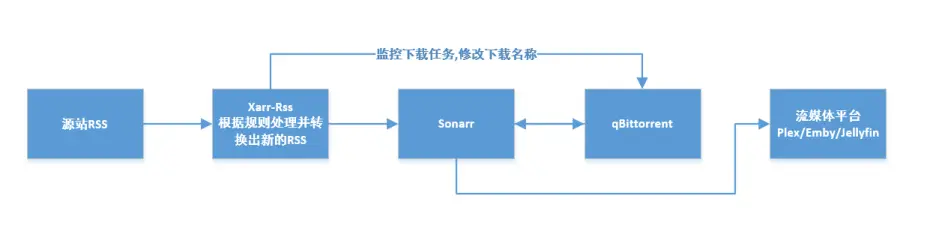
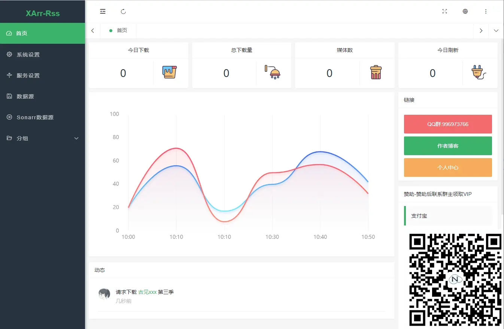

# XArr-Rss 教程

> XArr-Rss 剧情Rss订阅处理器

## 概述
XArr-Rss可以简单理解为一个RSS转换器，它可以将各个BT/PT发布站点的RSS内容转换成Sonarr能正确识别的RSS内容。
它在整个自动化流程中扮演索引器的角色，定位与Prowlarr、Jackett类似，主要针对日本动画尤其是新番着重做了优化，可以和其它索引器互为补充。

## 进入教程
[点我开始娱乐](https://xiaoyi510.github.io/xarr-rss/)

## 运行流程

## 特性
- 自动匹配精度高
- 匹配规则自由度高
- 国产本地化-界面及媒体数据都是全中文
- 动漫,电视剧 不分国籍皆可识别
- 联动下载器,解决Sonarr解析错误问题
- **作者能肝,作者能肝,作者能肝**

## 系统截图

## 捐赠

如果您觉得 XArr系列软件 对您有帮助,或者想给我微小的工作进行支持,欢迎捐助给小老弟我

捐助后可联系我领取对应赞助会员

### 微信捐赠

### 支付宝

## 交流群
QQ群: 996973766 [点击链接加入群聊【XArr 家庭影院一条龙】](https://jq.qq.com/?_wv=1027&k=qDGn9kmv)

## 其他教程
- [作者-博客教程](https://blog.52nyg.com/2022/04/1513)
- [SanaeMio-B站教程](https://www.bilibili.com/read/cv16515847)
- [SanaeMio-什么值得买教程](https://post.smzdm.com/p/ao9lr4x9/)

## 感谢
感谢群友`SanaeMio`的大力支持,帮忙撸文档,帮忙一起肝测试 哈哈