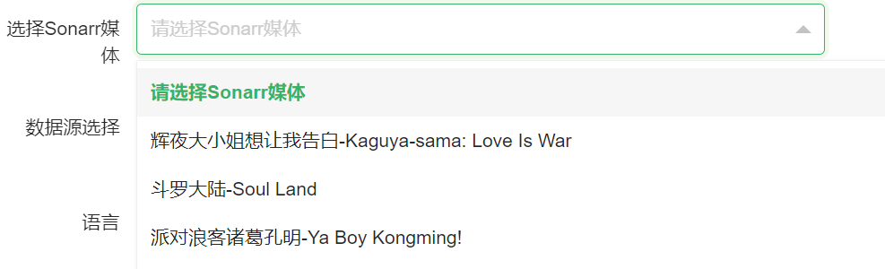

# 分组管理
    点击左侧菜单中增加的分组 进入分组媒体管理

## 列表

## 添加分组媒体
**点击新增会出现以下界面**

## 界面功能详解
* 选择Sonarr媒体 *必选
  * Sonarr中的媒体信息-可搜索中英文标题

* 数据源选择 多选
  * 被选择媒体使用那些数据源进行匹配  比如我想匹配 蜜柑和漫花的 就都勾上即可(前提需要在数据源中添加哦)
* 语言
  * 在Sonarr中可识别的语言 如 Chinese English 等
  * **赞助会员可填写 -1 自动识别**
* 质量
  * 在Sonarr中可被识别的质量 如 WebDL-1080p BdRip-720p等
  * **赞助会员可填写 -1 自动识别**
* 规则
  * 匹配类型
    * 正则表达式
      * 此处的正则表达式跟普通正则表达式有所不同 由于使用Golang进行开发 golang正则表达式与普通正则表达式不同 = = 建议浏览
      * [Golang正则教程 点我查看](https://blog.52nyg.com/2022/04/1509)
      * 写法案例
        * 原始:【幻月字幕组】【22年日剧】【妖怪合租屋 归来怪】【15】【1080P】【中日双语】
        * 正则:【幻月字幕组】【22年日剧】【妖怪合租屋 归来怪】【(?P<episode>\d+)】【1080P】【中日双语】
      * 其中 (?P<episode>\d+) 为固定写法 表示集数所在位置
      * [] () . * ? 此类请使用反斜杠\[\]
    * 全自动匹配标题
      * 为此类型的情况下 XArr-Rss 将会自动根据标题去匹配正确的集数 自动模式下可支持 E01-05 此集数类型
      * 自动匹配下 包含标题 可输入 需要匹配的文件标题 如 我想要那个字幕组等等 
      * 填写规则为  a|b,c 逗号优先 | 次优先级规则
      * 规则解答为 必须匹配c 且 a或者b 中的一个 
      * `,`为且 `|`为或
      * 也可以什么都不填写 自动匹配出合适的集数 准确率可能高达 90%
      * 
      * 赞助会员懒人工具
  * 正则表达式
    * 如果匹配类型选择为正则表达式
    * 那么此处填写规则为 golang 正则匹配
    * 必须包含 (?P<episode>\d+)
    * 其中 (?P<episode>\d+) 为固定写法 表示集数所在位置
    * **转义正则表达式内容**
      * 将输入的内容 ()[]等特殊字符给转义一次 
    * **测试匹配效果** 
      * 测试右侧列表中是否有可匹配的标题
    * **替换选择文本为集标记**
      * 
      * 如上图所示 选中05后点击 `替换选择文本为集标记` 按钮
      * 即可生成下图功能
      * 
      * 但是请先转义后点击此按钮哦 否则再次点击转义按钮 会将生成的匹配规则给转义
    * **自动获取集标记**
      * 复制标题进来后 全自动识别集数位置并且自动转义和生成正则表达式
      * 效果如下
      * 
  * 偏移量
    * 一般不需要填写
    * 填写效果如 当前为 17集 但是上一季视频有 12集 可能现在需要为 S02E05 这样的集数 可能就需要 填写-12
    * 如果不修改 则效果为 S02E17
  * 季
    * 自动计算
      * 赞助会员功能 可使用自动计算第几季
      * 原理: 在原标题中涵盖 S02 S2 第三季 会自动使用对应季
      * 如果标题中未能涵盖以上内容 则会根据第几集来计算出对应季
    * 手动选择第几季
      * 选择匹配规则对应使用的季信息
  * 添加规则
    * 如一个媒体有多个字幕组发布 可添加多个规则进行匹配 多个规则之间以 或 处理 等于任意一个规则生效 则匹配成功
* 右側 
  * 选择查看的数据源
    * 选择后右侧列表会显示对应的数据源信息
  * 点击某一个标题会自动复制