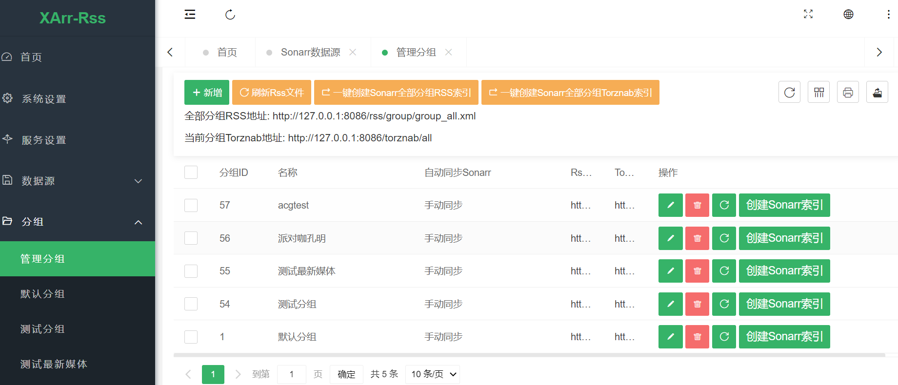
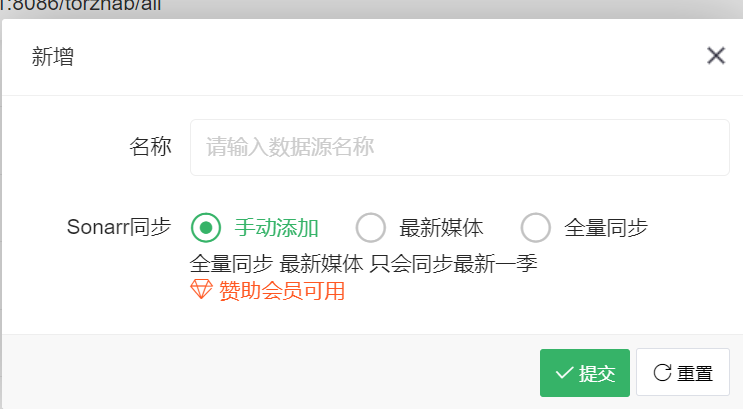
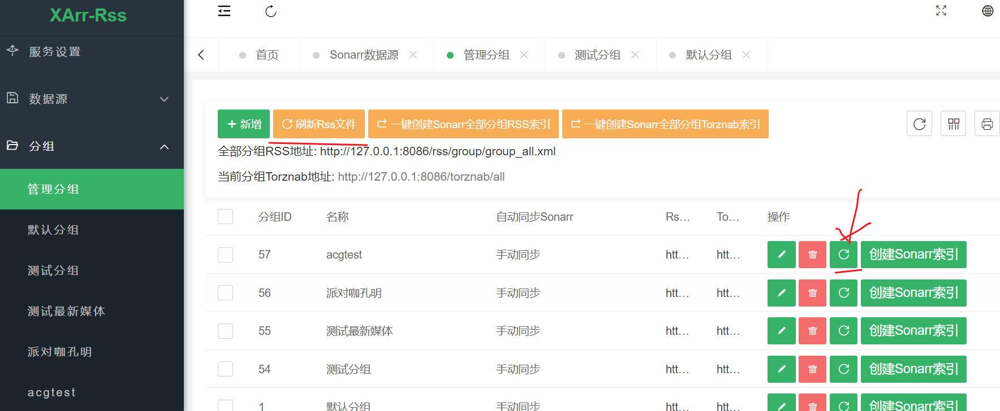

# 分组
    分组为整个系统中的核心功能 分组中添加媒体数据用于设置需要监控的影片
    如果分组中的配置的数据源中有匹配的影片规则 则会自动筛选

**列表展示**

## 添加分组
    点击新增即可弹出下面的弹框
* 名称
  * XArr-Rss 系统内识别的分组名 可在左侧菜单看到
* Sonarr 同步
  * 手动添加 默认
    * 不会从Sonarr同步数据 需要自己选择Sonarr数据
  * 最新媒体
    * Sonarr中添加的新媒体数据会自动同步过来
  * 全量同步
    * Sonarr中的所有媒体都会同步过来

## 刷新分组数据
  刷新有两种方式

1. 点击表格上方的菜单 刷新Rss文件
2. 点击对应分组后面的 刷新按钮 

## 创建Sonarr索引
    会自动在Sonarr中创建索引 不需要手动添加单次 不过建议手动添加一次 熟悉一下

  

## 分组订阅地址
  使用在Sonarr中的索引地址
1. Rss索引地址 可使用在Sonarr-Setting-Indexer-Torrent RSS Feed
   1. Rss 索引地址在Sonarr中不可被主动搜索 只能等Sonarr自动搜索
2. Torznab索引地址 可使用在Sonarr-Setting-Indexer-Torznab
   1. 可以被主动搜索 牛逼加闪电

注:全部分组RSS数据地址: `http://127.0.0.1:8086/rss/group/group_all.xml`
