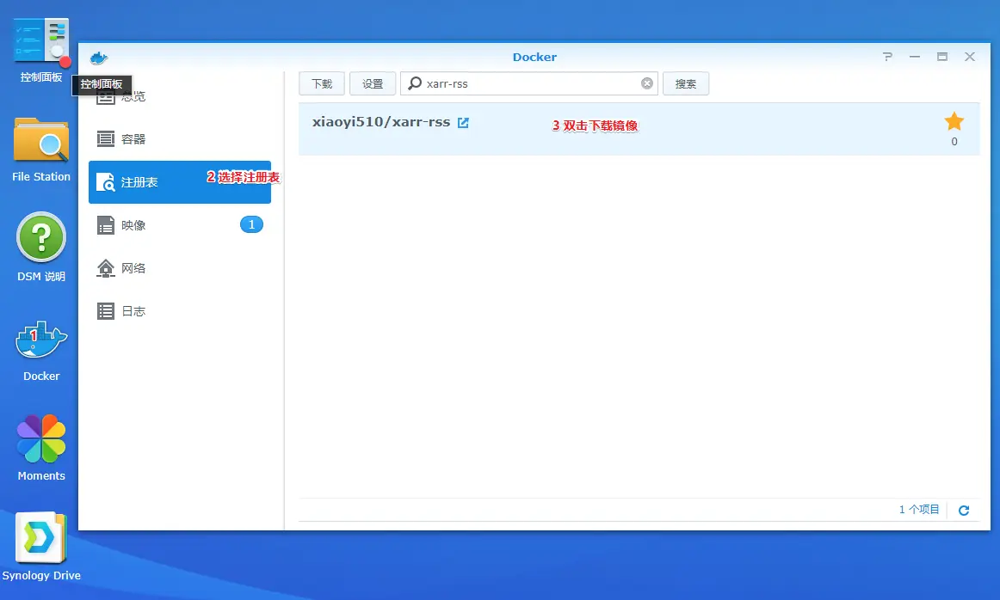
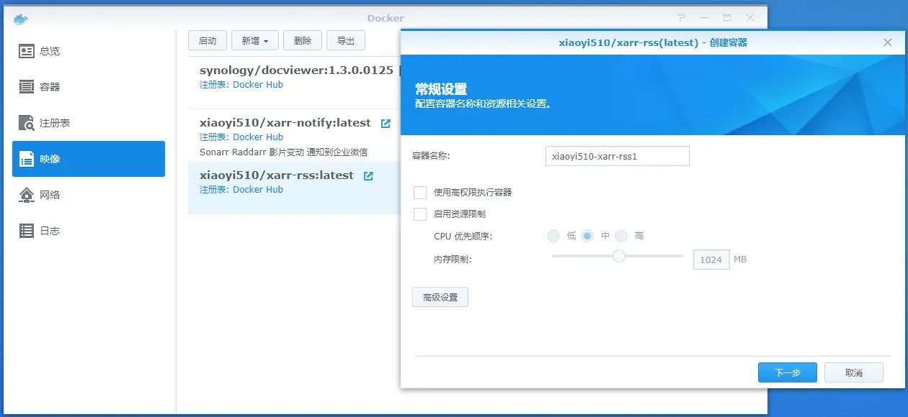
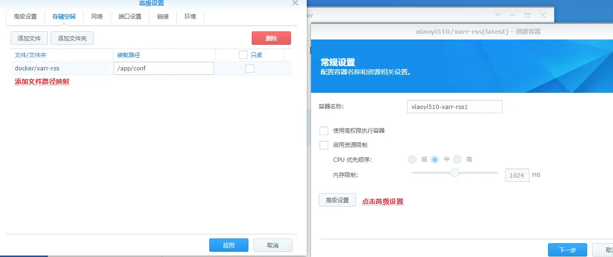
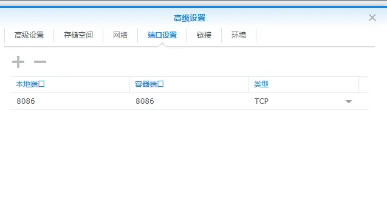

# 群晖安装

## 下载镜像
1. 打开Dokcer
2. 打开注册表
3. 搜索 xarr-rss
4. 双击下载镜像
    

## 创建容器
1. 进入映像
2. 双击xarr-rss
3. 进行创建

4. 设置容器目录
    
    点击高级设置-存储空间 添加目录映射 容器内的目录为/app/conf
    

5. 设置端口
   
    填写本地端口`为你的主机使用的端口` 和 容器端口 `8086` 类型 `TCP`
    

6. 设置完成 下一步就行了
