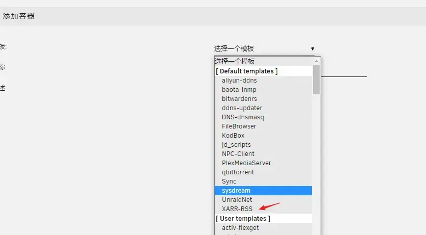
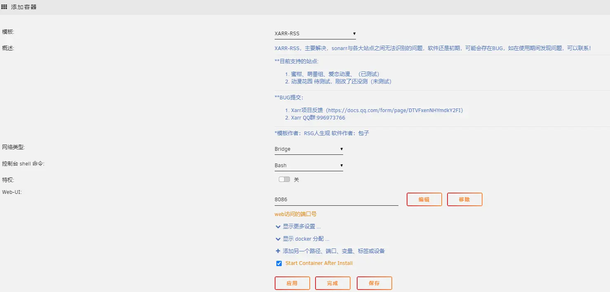

# Unraid 安装教程

## 模板安装
目前提供两个Unraid应用模板，在Unraid命令行中执行命令下载即可

- 作者节点
> curl -sSL https://xarr.52nyg.com/unraid-template/config.sh | sh

- 人生观节点
> curl -sSL https://file.lxg2016.com/assets/docker/xarr-rss/config.sh | sh

模版安装完成后进入Docker添加容器

## 添加容器
### 选择XArr-Rss

### 配置访问端口号

安装完成 
访问 <http://主机:端口号> 即可进入配置中心