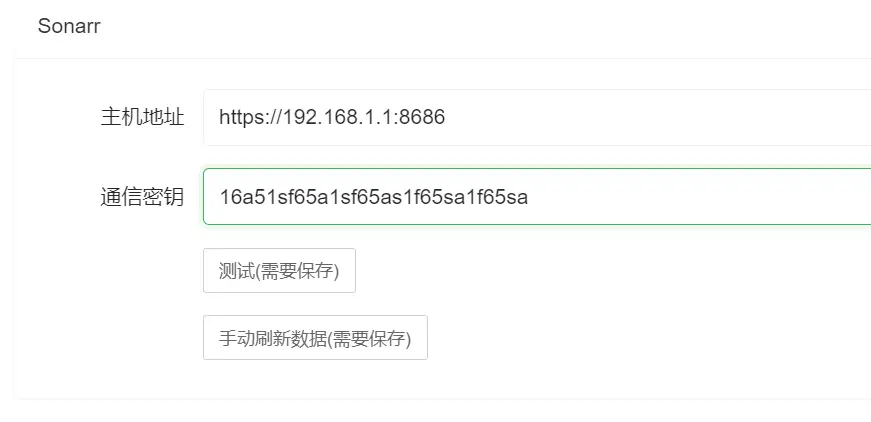
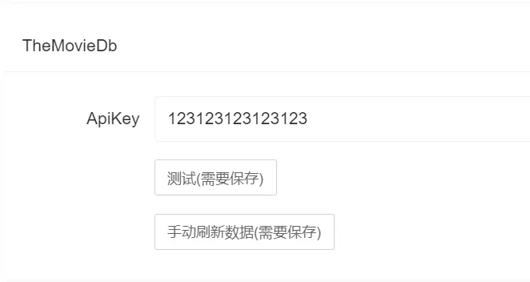
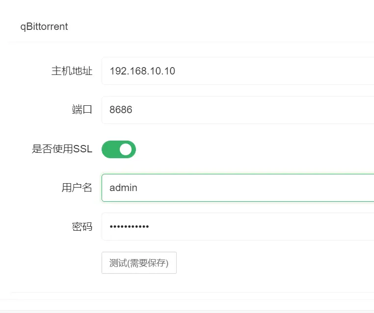

# 服务配置

## Sonarr配置
    配置为XArr-Rss和Sonarr可以互相访问到的地址,否则可能会造成异常失败

> 手动刷新数据 用于想要立即生效的请点击此处
## ThemovieDb
    用于同步中文本地化使用,如果没有apikey,请前往官网进行申请(申请内容提示错误一般是描述内容过少)
    ApiKey获取地址 https://themoviedb.org/settings/api
    申请成功后使用v3 apikey填入即可

## qBittorrent
    端口: 对应访问端口
    SSL: 如果有https则选择否则不勾选
    用户名,密码: qb登录账号密码

> 所有配置请在保存后点击一次测试看是否可以连通
