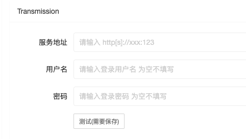

# 服务配置

## Sonarr配置
    配置为XArr-Rss和Sonarr可以互相访问到的地址,否则可能会造成异常失败
    同步时间为:几分钟同步一次sonarr数据

> 手动刷新数据 用于想要立即生效的请点击此处
## ThemovieDb

### apikey
    用于同步中文本地化使用,如果没有apikey,请前往官网进行申请(申请内容提示错误一般是描述内容过少)
    ApiKey获取地址 https://themoviedb.org/settings/api
    申请成功后使用v3 apikey填入即可
### 代理/HostIP
可以填入对应api.themoviedb.org 指向的IP地址 如:`65.8.158.61`
或者填入代理信息
> socks5://127.0.0.1:1234
> 
> http[s]://127.0.0.1:1234

## qBittorrent
    主机地址: 对应访问地址 如: http[s]://127.0.0.1:8080
    用户名,密码: qb登录账号密码

## Transmission
    主机地址: 对应访问地址 如: http[s]://127.0.0.1:8080
    用户名,密码: qb登录账号密码

> 所有配置请在保存后点击一次测试看是否可以连通
