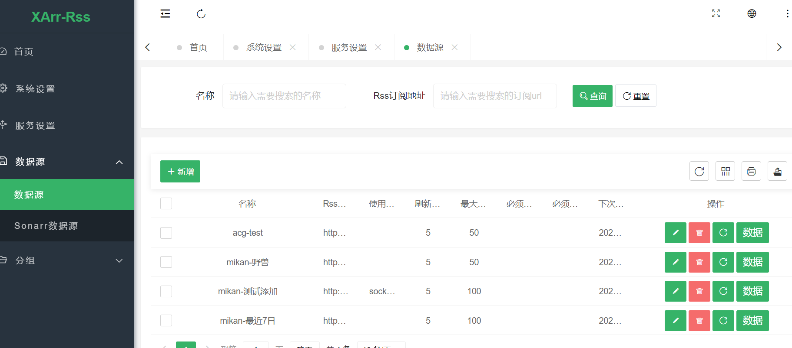
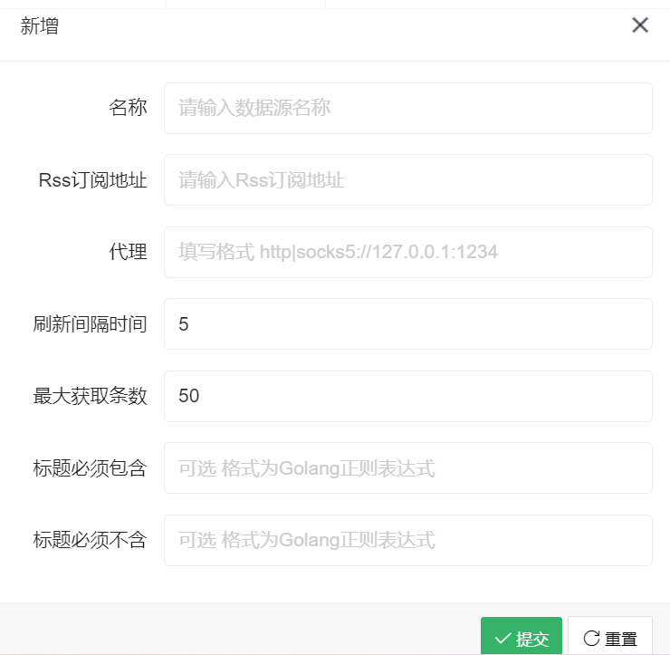
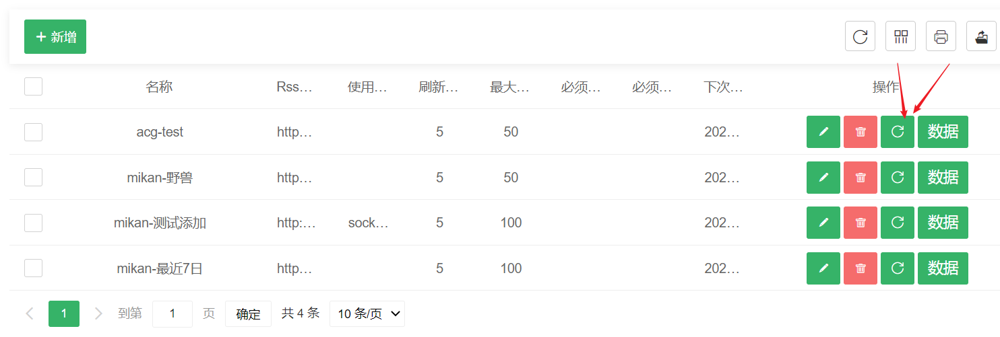
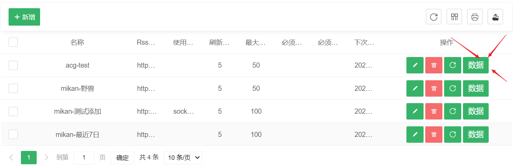
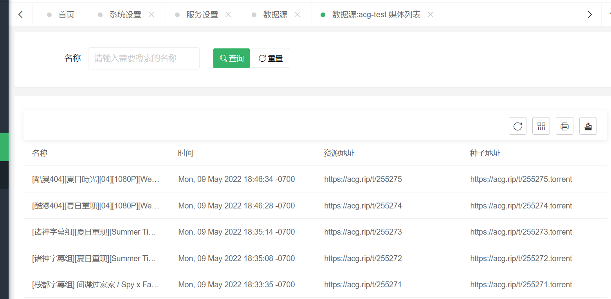

# 数据源配置
    字面意思就是本软件所有影片更新的数据来源 能不能有数据都靠这儿了

## 数据源配置说明
    点击数据源页面中的 新增 按钮

* 名称 
  * XArr-Rss系统内识别的名称

* Rss订阅地址
  * 订阅地址需要为xml版本的Rss订阅地址

* 代理
  * 如果订阅地址需要代理才能访问 则填写代理即可 格式 http|socks5://127.0.0.1:1234

* 刷新间隔时间
  * 单位分钟 数据源每隔几分钟刷新一次

* 最大获取条数
  * 数据源中只获取前面多少条数据 建议不要太高

* 标题必须包含
* 标题必须不含
  * 以上两个为可选 格式为Golang正则表达式 
  * 案例: 如必须包含 简体|繁体|简繁 的标题才会进行采集

## 数据源列表功能
### 刷新某个数据源

### 查看某个数据源数据

#### 数据源中的数据列表

