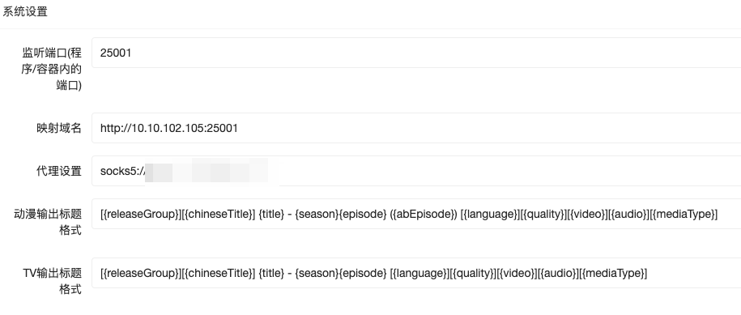

# 系统配置

**映射域名**

需要让Sonarr,qBit都能访问到的地址,否则可能会出一系列问题

一般为自己的局域网地址 如:`http://192.168.1.20:8086`

或者写为自己的公网对应的地址

**监听端口**
系统内部监听使用的端口号 一般docker版本无需修改

**代理设置** 
全局系统代理信息填写
填写方式
1. socks5://127.0.0.1:1080
2. http://127.0.0.1:1080

注: 需要在数据源或tmdb进行开启代理才可使用

### RSS输出标题格式化
#### 动漫输出标题
默认格式:
> [{releaseGroup}][{chineseTitle}] {title} - {season}{episode} ({abEpisode}) [{language}][{quality}][{video}][{audio}][{mediaType}]

#### TV输出标题
默认格式:
>[{releaseGroup}][{chineseTitle}] {title} - {season}{episode} [{language}][{quality}][{video}][{audio}][{mediaType}]

#### 名词解释
    releaseGroup:发布组
    chineseTitle:中文标题
    title:原始标题
    season:季
    episode:集
    abEpisode:绝对集数
    language:语言
    quality:质量
    video:视频类型
    audio:音频
    mediaType:媒体类型

****

